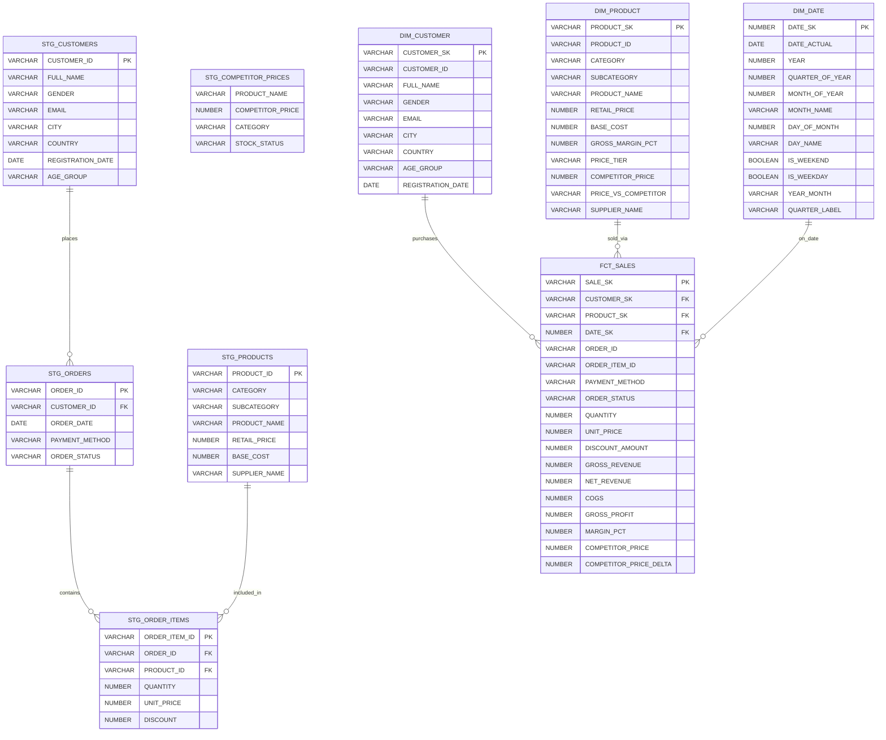

# Entity Relationship Diagram — Enterprise Retail Analytics Engine

## Star Schema Overview

The data warehouse follows a **classic star schema** — one central fact table surrounded by denormalized dimension tables. This design optimises for analytical read performance (OLAP) over transactional write performance (OLTP).

---

## Mermaid ERD

---

## Relationship Explanations

| Relationship | Cardinality | Description |
|---|---|---|
| `DIM_CUSTOMER → FCT_SALES` | 1 : Many | One customer can have many sales transactions |
| `DIM_PRODUCT → FCT_SALES` | 1 : Many | One product can appear in many order items |
| `DIM_DATE → FCT_SALES` | 1 : Many | One date can have many transactions |
| `STG_CUSTOMERS → STG_ORDERS` | 1 : Many | One customer places many orders |
| `STG_ORDERS → STG_ORDER_ITEMS` | 1 : Many | One order contains many line items |
| `STG_PRODUCTS → STG_ORDER_ITEMS` | 1 : Many | One product appears in many order items |

---

## Key Design Decisions

### Primary Keys
- **Surrogate Keys** (SK): Used in dimension and fact tables. Generated via `dbt_utils.generate_surrogate_key()` — hash of natural key columns. This decouples the warehouse from source system IDs.
- **Natural Keys** (ID): Original source system identifiers preserved alongside surrogate keys.

### Foreign Keys
- All FK relationships in `FCT_SALES` reference dimension surrogate keys.
- This enables `JOIN` operations without needing source system knowledge.

### Why Star Schema?
1. **Query Performance**: Fewer JOINs than 3NF (normalised) models
2. **BI Tool Compatibility**: Tools like Tableau, Power BI, Metabase expect star schemas
3. **Understandability**: Business users can navigate the model intuitively
4. **Snowflake Optimised**: Columnar storage benefits from wide dimension tables

### Grain
- **FCT_SALES grain**: One row per **order line item** (not per order)
- This allows product-level analysis (margin per product, discount per item)

---

## Competitor Price Integration

The `COMPETITOR_PRICE` and `COMPETITOR_PRICE_DELTA` columns in `FCT_SALES` and `DIM_PRODUCT` come from the web-scraped `STG_COMPETITOR_PRICES` table, joined on product name fuzzy matching during the `DIM_PRODUCT` transformation. This enables price competitiveness analysis directly in the fact table.
